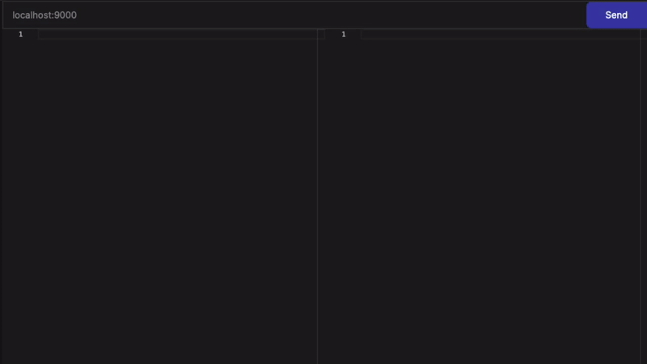

# README

## About

Kalisto is a grpc(http in progress) client.

### Why is it special?
There are a few issues with the grpc graphic clients:
1. it makes you to describe a request using json. It might be ok for a regular REST api, later you can reuse the request or fill it based on your project's fixtures. But it doesn't go well for a binary protocol.
2. The api navigation is hard. it doesn't allow to use well experienced technic like folder structure.
3. It doesn't help to describe a request since some tools don't even know what kind of request you send.
4. There are no tools with a real scripting. There are some features are named "post scirpt" that introduce a side effect and state to the application.

I'm here to fix it.

### Download
http://kalisto.app

### Demo

### Report a bug
[Here](https://github.com/Kalisto-Application/kalisto/issues/new)

### Roadmap
[Here](https://github.com/orgs/Kalisto-Application/projects/1)

### Discord
[Link](https://discord.gg/XPDGPkMR4x)

# Development guide

## Live Development 

To run in live development mode, run `wails dev` in the project directory. This will run a Vite development
server that will provide very fast hot reload of your frontend changes. If you want to develop in a browser
and have access to your Go methods, there is also a dev server that runs on http://localhost:34115. Connect
to this in your browser, and you can call your Go code from devtools.

## Building

To build a redistributable, production mode package, use `wails build`.

## Tasks execution

Page: https://pydoit.org/contents.html

- install task manager doit: `pip3 install doit` or `pip install doit`
- look at the commands: `doit` to show help or `doit list` to show available tasks

## Generate mocks

Install mockery: `go install github.com/vektra/mockery/v2@v2.29.0`

## Get stared

- `cd frontend`
- `npm i && npm run build`
- `cd ../`
- `wails dev`
  OR `rm -rf frontend/dist && wails dev`
- [optional] open in a browser: http://localhost:34115

## Troubleshooting

Node runtime may fail due to lack of memory.
For such case set a var NODE_OPTIONS="--max-old-space-size=4096" or even more memory.

# Contribution guide

Most of api doesn't promise backward compatibility. 
Please, discuss your plans in advance first.

###### tags
kalisto grpc client gui scripting automation qa